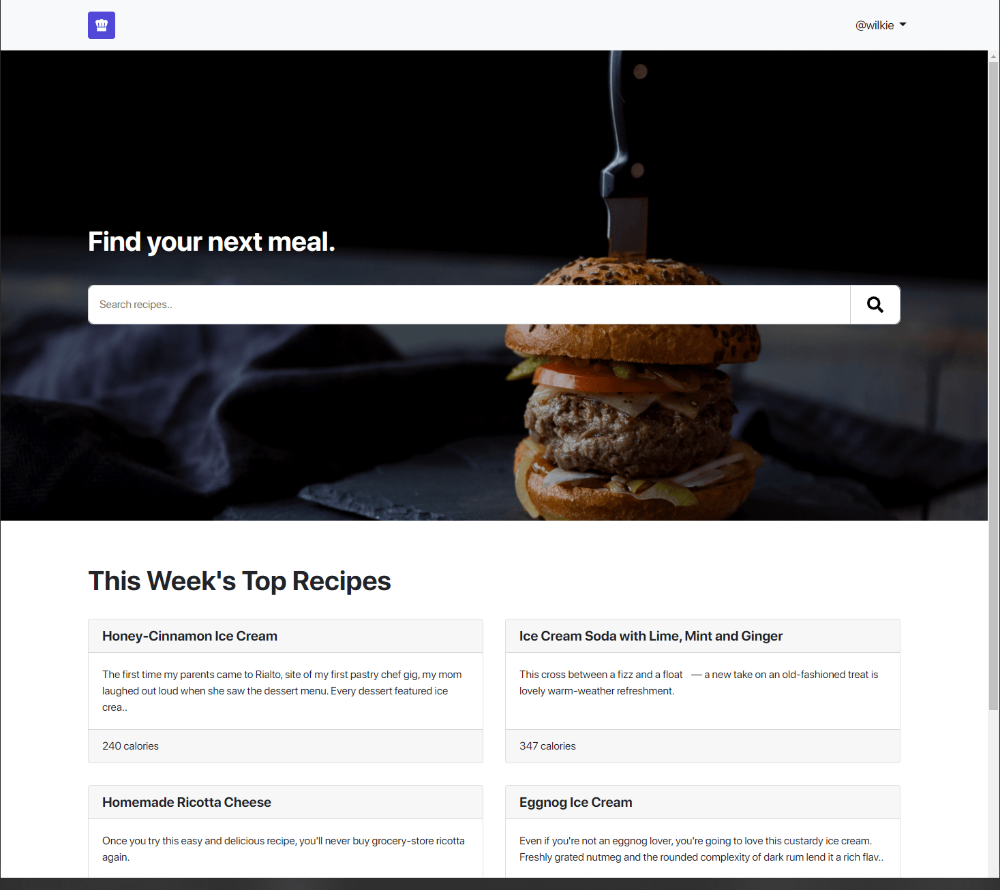
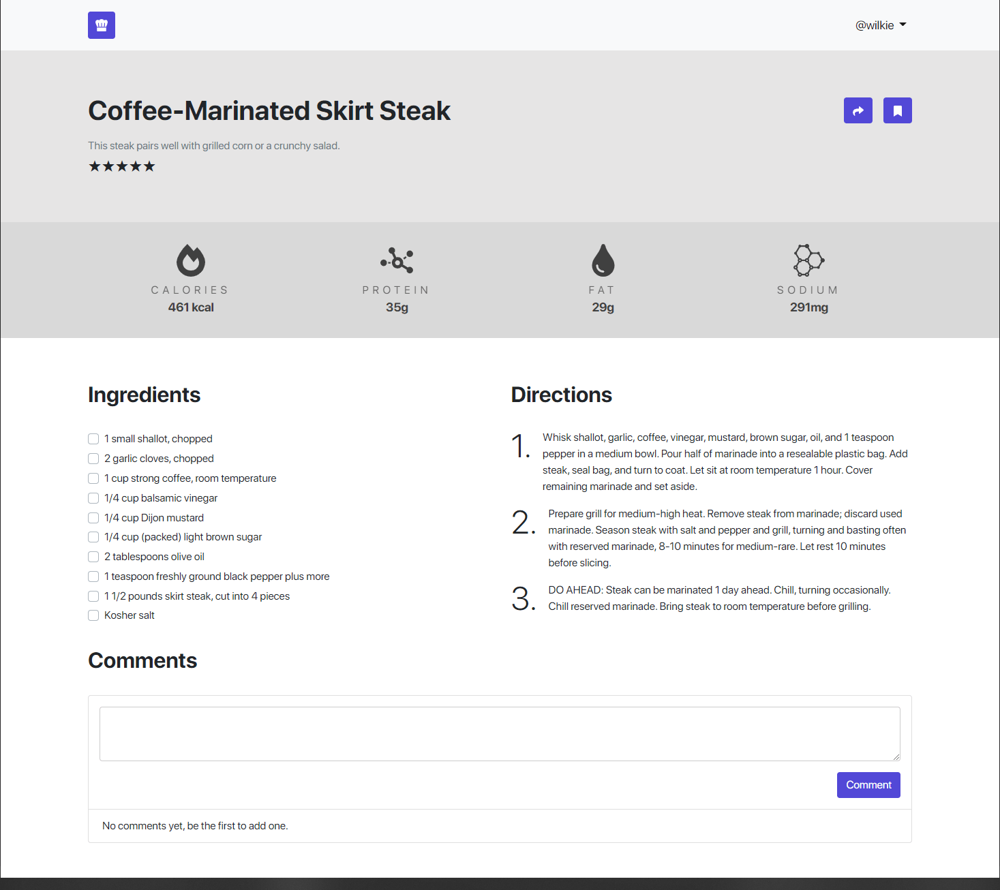

# RecipeDB

RecipeDB is a simple client-server application created for the "Full Stack Strategies & Development" module in university. The back-end is written in Python using Flask and the front-end is written in JavaScript using Angular.

